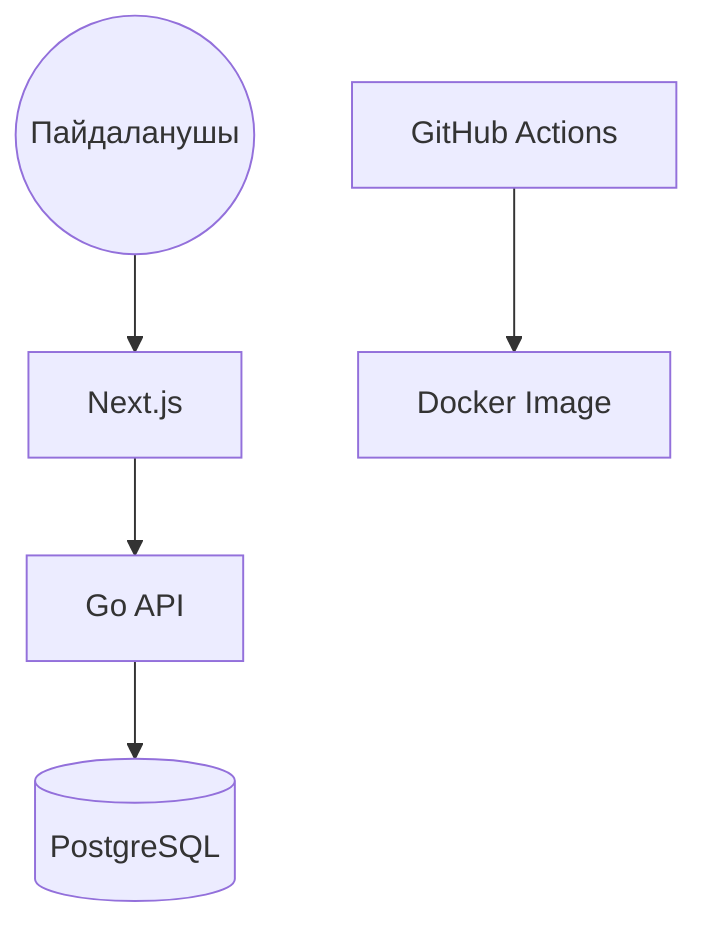

# Project Management & Infrastructure 2025

## 1. Жобаны жоспарлау (Management)
* **Әдістеме:** Scrum
* **Құралдар:** GitHub Projects
* **Спринттер:** 2 апталық циклдер

## 2. Технологиялық стек
* **Frontend:** Next.js
* **Backend:** Go
* **Инфрақұрылым:** Docker, Kubernetes, Terraform

## 3. Архитектуралық диаграмма

4. Қосымша Инфрақұрылымдық Жоспар
4.1. Орталар (Environments)
Біз әзірлеу процесінде келесі үш ортаны қолданамыз:

Dev: Әзірлеушілердің жеке тестілеуіне арналған.

Stage: QA-инженерлеріне арналған тестілеу ортасы (Prod-қа барынша жақын).

Prod: Клиенттерге арналған жұмыс ортасы.

4.2. Мониторинг жоспары
Жүйенің тұрақтылығын қамтамасыз ету үшін келесі құралдар қолданылады:

Grafana: Жүйе жүктемесінің (CPU, RAM, Network) графиктерін бақылау үшін.

Sentry: Нақты уақыт режимінде кодтағы қателерді қадағалау және хабарлау үшін.

4.3. Қауіпсіздік (Secrets Management)
Құпия деректерді (Database парольдері, API кілттері) қауіпсіз сақтау үшін:

Әдіс: Біз HashiCorp Vault немесе Kubernetes Secrets (шифрланған түрде) қолдануды жоспарлаймыз.

Қолдану: Құпиялар CI/CD конвейері арқылы тек қажетті ортаға (Stage/Prod) ғана жіберіледі.
